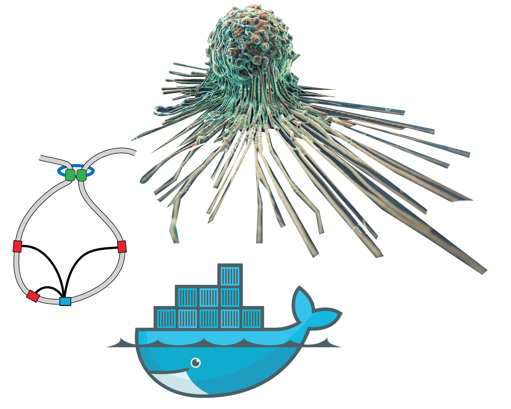

# <h1>
Euplotid
</h1>

## Abstract
<h2>
 A linux-based platform to identify, predict, and assess the difficulty of inducing transition mutations on Cis-Regulatory Elements constrained within Insulated Neighborhoods 
</h2>
Euplotid is composed of a set of constantly updating bioinformatic pipelines running on Docker images which enables a user to build and annotate Insulated Neighborhoods (INs) genomewide starting from raw sequencing reads of DNA-interactions, chromatin accessibility, and RNA-sequencing. Reads are quantified using the latest computational tools (RSEM, STAR, Origami, HiCPro) and the results are normalized, quality-checked, and stored. INs are then built using a Louvain based graph partioning algorithm parametrized by the chromatin extrusion model and CTCF-CTCF interactions. Cis-Regulatory Elements (CREs) are defined using chromatin accessibility peaks which are then mapped to Transcription Start Sites (TSSs) based on inclusion within the same IN. Convolutional Neural Networks (CNNs) are combined with Long-Short Term Memory (LSTM) in order to provide a statistical model mimicking Transcription Factor (TF) binding, one (CNN+LSTM) for each TF in the genome is trained on all available Chip-Seq and SELEX data for that TF to learn its binding motifs. The TF-(CNN+LSTM)s are then merged and trained on chromatin accessibility data thereby building a rationally designed neural network architecture capable of predicting chromatin accessibility. TF binding and identity at each peak is annotated using this trained neural network architecture. By in-silico mutating and re-applying the neural network we are able to gauge the impact of a transition mutation on the binding of any human TF. The annotated output can be visualized in a variety of 1D, 2D and 3D ways overlayed with existing bodies of knowledge, such as GWAS results. Once a particular CRE of interest has been identified by a biologist the difficulty of a <a href="https://blog.benchling.com/base-editor/"> Base Editor 2 (BE2) </a> mediated transition mutation can be quantitatively assesed and induced in a model organism. 
div style="text-align:center">

## Get Docker
[**INSTALL DOCKER HERE**](https://www.docker.com/community-edition#/download")

The pipelines available and their capabilities are described in [Methods](docs/methods.md)  which helps you pick the right of 3 Docker images.

Remember to define the coorect directories when running the Docker image depending on your local machine:

Whitehead:
~~~
	-v "/Users/dborgesr/Documents/chia_origami_ints/:/input_dir" \
	-v "/Users/dborgesr/Documents/chia_origami_ints/:/tmp_dir" \
	-v "/Users/dborgesr/Documents/chrom3d/basset_out/:/output_dir" \
	-v "/Users/dborgesr/Documents/chia_origami_ints/:/annotation_dir" \
~~~

## Pull and run your image!

* Megatid: process sequencing data into quantified values (FPKM,peaks,etc)
~~~ 
docker run --name megatid -p 8891:8891 -tid \
	-v "/your/input/directory:/input_dir" \
	-v "/your/temporary/directory/:/tmp_dir" \
	-v "/your/output/directory/:/output_dir" \
	-v "/your/annotation/directory/:/annotation_dir" \
	dborgesr/euplotid:megatid
~~~
* Euplotid: build and visualize INs and learn/predict TFs bound at CREs
~~~
docker run --name euplotid -p 8890:8890 -tid \
	-v "/your/input/directory:/input_dir" \
	-v "/your/temporary/directory/:/tmp_dir" \
	-v "/your/output/directory/:/output_dir" \
	-v "/your/annotation/directory/:/annotation_dir" \
	dborgesr/euplotid:euplotid
~~~
* Minitid: visualize and interact with built and annotated INs
~~~
docker run --name minitid -p 8892:8892 -tid \
	-v "/your/input/directory:/input_dir" \
	-v "/your/temporary/directory/:/tmp_dir" \
	-v "/your/output/directory/:/output_dir" \
	-v "/your/annotation/directory/:/annotation_dir" \
	dborgesr/euplotid:minitid
~~~
* Nanotid: ARM architecture image to build and visualize INs and learn/predict TFs bound at CREs
~~~
docker run --name nanotid -p 8893:8893 -tid \
	-v "/your/input/directory:/input_dir" \
	-v "/your/temporary/directory/:/tmp_dir" \
	-v "/your/output/directory/:/output_dir" \
	-v "/your/annotation/directory/:/annotation_dir" \
	dborgesr/euplotid:nanotid
~~~
Your Docker image should be running on your computer (local), now you can access and use it!

## Go to your image!
* Megatid   local:[http://localhost:8891](http://localhost:8891) Whitehead internal:[http://airstream:8891](http://airstream:8891)
* Euplotid   local:[http://localhost:8890](http://localhost:8890) Whitehead internal:[http://airstream:8890](http://airstream:8890)
* Minitid   local:[http://localhost:8892](http://localhost:8892) Whitehead internal:[http://airstream:8892](http://airstream:8892)
* Nanotid   local:[http://localhost:8893](http://localhost:8893) Whitehead internal:[http://airstream:8893](http://airstream:8893)

Each Docker image has different capabilities (packages installed in each Docker image are described in [packageManagement](docs/packageManagement.md))
