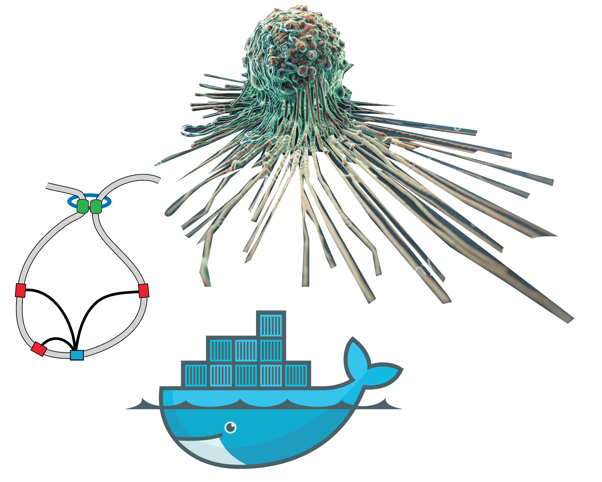
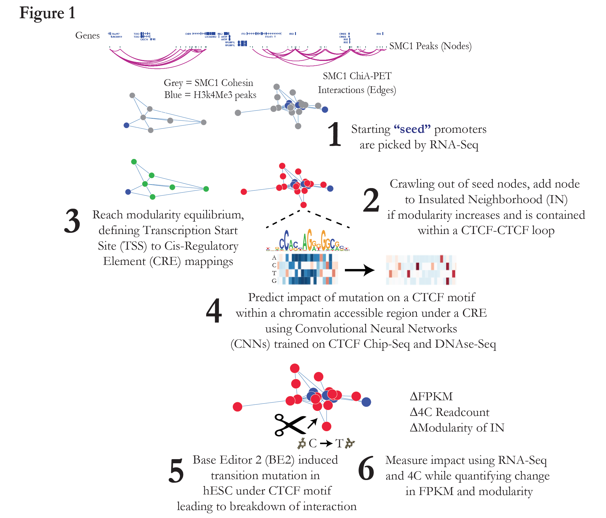

<h1>
Euplotid
</h1>

<h2>
 A fully capable and evolving platform to assemble sequencing reads into annotated pseudo physical models to guide designed transition mutations of individual Cis-Regulatory Elements within Insulated Neighborhoods
</h2>
Euplotid is composed of a set of constantly updating bioinformatic pipelines running on Docker images which enable a user to build and annotate Insulated Neighborhoods (INs) genomewide starting from raw sequencing reads of DNA-interactions, chromatin accessibility, and RNA-sequencing. Reads are quantified using the latest computational tools (RSEM, STAR, Origami, HiCPro) and the results are normalized, quality-checked, and stored. INs are then built using a Louvain based graph partioning algorithm parametrized by the chromatin extrusion model and CTCF-CTCF interactions. Cis-Regulatory Elements are defined using chromatin accessibility peaks which are then mapped to TSSs based on inclusion within the same IN. Convolutional Neural Networks (CNNs) are combined with Long-Short Term Memory (LSTM) (a type of Recurrent Neural Network(RNN)) in order to provide a statistical model mimicking Transcription Factor (TF) binding, one CNN+LSTM for each TF in the genome is trained on Chip-seq data to learn TF binding motifs.  The TF NNs are then merged and trained on chromatin accessibility data eventually leading to a neural network architecture capable of predicting chromatin accessibility. TF binding at each peak is annotated using this trained neural network architecture. The annotated output can be visualized in a variety of 1D, 2D and 3D ways overlayed with existing bodies of knowledge. Once a particular CRE of interest has been identified the difficulty of inducing a [Base Editor](http://www.nature.com/nature/journal/v533/n7603/full/nature17946.html) transition mutation can be quantitatively assesed and then performed on a model organism. 

The pipelines available and their capabilities are described in [pipeline README](pipelines/README.ipynb) which helps you pick the right of 3 Docker images:
* [Megatid](http://airstream:8891) process sequencing data into quantified values (FPKM,peaks,etc)
~~~ 
docker pull dborgesr/euplotid:megatid #port 8891 
~~~
* [Euplotid](http://airstream:8890) build and visualize Insulated Neighborhoods and learn/predict TFs bound at Cis-regulatory Elements
~~~
docker pull dborgesr/euplotid:euplotid #port 8890
~~~
* [Minitid](http://airstream:8892) visualize and interact with built and annotated Insulated Neighborhoods
~~~
docker pull dborgesr/euplotid:minitid #port 8892
~~~

Run your image: 
~~~
docker run --name megatid -p [8891|8890|8892]:[8891|8890|8892] -tid \
	-v "/lab/solexa_public/:/input_dir" \
	-v "/home/dborgesr/work_space/tmp/:/tmp_dir" \
	-v "/home/dborgesr/work_space/out_dir/:/output_dir" \
	-v "/home/dborgesr/work_space/annotation:/annotation_dir" \
	dborgesr/euplotid:[megatid|euplotid|minitid]
~~~
NOTE to publish the right port for the matching image (-p) when using docker run!

Each Docker image has different capabilities (packages installed in each Docker image are described in [packageManagement](pipelines/packageManagement.ipynb) 
